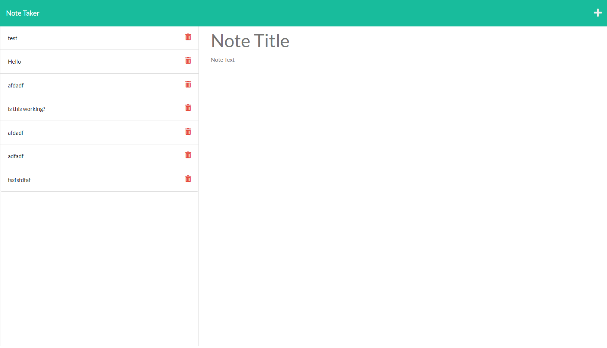

Project Title: Note-Taker

Project Description: This fill stack interactive application takes in the dependencies of express. It displays route handling with a GET and Post requests. As a person with a busy schedule this will help the user add, save and retrieve notes that are saved and pulled from a server.  
 
 Link: https://github.com/RPAPE3/Note-Taker 

Screenshot: 
